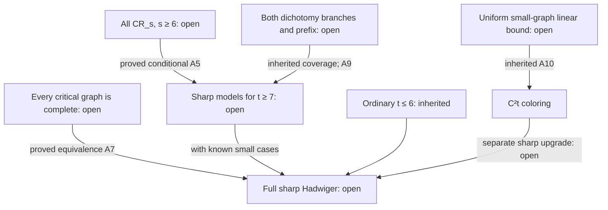

# RL3 dependency map and proof classifications

Cutoff: 2026-09-30. Status: **CLOSED/FROZEN RL3 record; carried into incoming RL4.** Incoming authority and source IDs are those pinned in INCOMING_SNAPSHOT.json.

## Definitions

M_t(G) means the entire simultaneous t-branch-set model in RL3_ROADMAP.md. R_s(H,S) means M_s(H) witnessed by sets B_i with B_i cap S nonempty for **every** i; roots can be chosen flexibly from S. It does not mean a model for each root separately or a fixed injection unless explicitly stated.

C_t(G) means chi(G)=t and every proper minor J of G satisfies chi(J)<=t-1. A proper minor is one not isomorphic to G. A t-counterexample also satisfies not M_t(G). Chromatic number is not assumed minor-monotone.

F_s(H,S) means chi(H)=s and, for **every** proper coloring c:V(H)->{1,...,s}, c(S)={1,...,s}. This universal optimal-coloring condition is colorfulness. One optimal coloring meeting all colors is insufficient.

CR_s is the candidate statement: for every finite simple H and every S subseteq V(H), F_s(H,S) implies R_s(H,S). This is Holroyd's known colorful-set strengthening at s. No CR_s for s>=6 is established in RL3; no comprehensive current-status claim is made.

## Backward chain, with justified forward arrows

| ID | Exact implication or dependency | Classification and limits |
|---|---|---|
| A1 | Failure at fixed t -> a minor-minimal t-counterexample G with C_t(G). | Proved analytic reduction; inherited RES-0028. Choose among minors with chi>=t, which remain K_t-minor-free. All proper minors have chi<=t-1. Vertex deletion gives chi(G)<=t, hence equality. No chromatic minor-monotonicity is used. |
| A2 | C_t(G) -> for every v, F_(t-1)(G-v,N_G(v)). | Proved analytic mathematics. Vertex deletion has chi=t-1: it is at most t-1 by criticality and at least t-1 by adding one color for v. If an optimal coloring missed a color on N(v), extending that color to v would contradict chi(G)=t. This also holds for t-vertex-critical graphs. |
| A3 | R_(t-1)(G-v,N(v)) -> M_t(G). | Proved analytic assembly. Add the singleton {v}. It is disjoint from every existing branch and adjacent to each because each meets N(v). All old pair adjacencies persist. |
| A4 | A2 plus CR_(t-1) -> M_t(G). | Proved **conditional** implication; CR_(t-1) remains candidate/open. No claim that CR is supplied by ordinary Hadwiger. |
| A5 | CR_s for every integer s>=6, together with inherited ordinary cases t<=6 -> full root. | Proved conditional implication with exhaustive parameter coverage. Reduce any failure t>=7 by A1 and apply A2–A4. All graph orders persist. |
| A6 | CR_6 -> ordinary Hadwiger at t=7. | Proved conditional implication only. Remaining ordinary orders: every t>=8. This is N1's precise payoff. |
| A7 | Full root <-> every C_t graph is K_t (all t). | Proved analytic equivalence. If root holds, a C_t graph has a K_t minor, which cannot be proper. Conversely every minor-minimal counterexample from A1 would have to be K_t. Replacing this with a new name reduces no open obligation. |
| A8 | At the *least failing* order t, C_t(G) -> an unrooted M_(t-1)(G-v). | Proved conditional reduction using ordinary Hadwiger at lower orders by choice of the least t, not by assuming the whole root. The rooted conversion remains missing. An arbitrary fixed-t failure does not itself license lower-order Hadwiger. |
| A9 | Counterexample at t>=T -> B_t OR D_t; elimination of both alternatives plus elimination of every 7<=t<T -> root. | Revalidated inherited preprint necessity, plus proved conditional logic. B_t,D_t,T are in BR-03. Branch exclusions and prefix handling are open. An OR does not close either branch. |
| A10 | Uniform small-graph linear hypothesis for the corollary's absolute C -> uniform C^2 t bound. | Inherited RES-0012. A further sharp-upgrade implication is open; this map supplies no arrow from a linear result alone to the root. |
| A11 | Covering/reducible configurations for every C_t counterexample -> exclusion of all such graphs -> root. | Proved conditional architecture; both universal coverage and scope-matched reductions are open. A finite list at each t leaves infinitely many t and possibly unbounded configuration sizes. |

## Map

Candidate boxes are obligations; arrows state conditional implications, not that their inputs have been proved.

## Circularity and compatibility guards

“Every proper minor is (t-1)-colorable” is a minimal-counterexample fact; it does not grant a (t-1)-coloring of G. “Every G-v has a K_(t-1) minor” grants no rooting on N(v). Menger paths found for different terminal pairs are not automatically simultaneously disjoint. CM-R refutes a sharp rooted replacement using only connectivity, chromatic number and a same-order unrooted minor.

CR_s is a sufficient strengthening whose antecedent is independently expressible in proper colorings. Taking S=V(H) includes ordinary Hadwiger at order s inside that strengthening. This is a warning about difficulty, not an assertion that its extra rooting obligation is harmless or equivalent. No reverse implication from ordinary Hadwiger to general CR_s is recorded.
