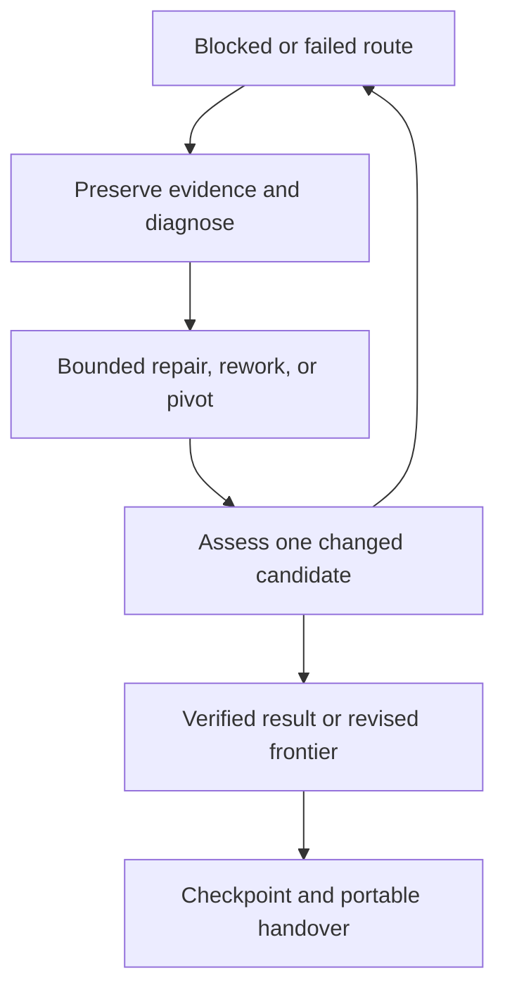

# RL state machine

`AGENTS.md` is binding.

## Terms

- **Incoming RL** — the unique current job named by `authoritative/START_HERE.md`.
- **Successor RL** — the next incoming job, which becomes authoritative only after the current RL is verified and promoted.
- **Local checkpoint** — ignored/non-authoritative research state.
- **Committed authority** — the remote default-branch commit whose `authoritative/` state has passed post-write readback.

## State flow

```text
Committed authority
  → start gate
  → local research/checkpoints
  → candidate handover
  → CLOSEOUT_LOCK
  → verification
  → one atomic RL transition commit
  → remote ref advancement
  → post-commit readback
  → successor committed authority
```

No other path creates mathematical authority.

## Research interruption

If work stops before promotion:

- leave remote `authoritative/` and `sessions/` unchanged;
- make no partial mathematical promotion;
- preserve the last verified checkpoint where possible;
- report exactly what remains unpromoted.

## Route recovery

A failed or blocked route enters a recovery subcycle inside the ordinary research phase:



Apply `docs/RESEARCH_RECOVERY_PROTOCOL.md`. Permission to explore a candidate is separate from proof admission. A scoped failure may retire a route while the programme remains active. Each checkpoint records lessons and the next bounded task; the subcycle cannot bypass the start gate, mathematical integrity, or CLOSEOUT_LOCK.

## Stop-and-repair

A failure freezes the last valid state and identifies the first invalid dependency.

Mechanical failures are repaired mechanically. Mathematical/proof-state failures require explicit correction or demotion when eventually promoted.

Affected deductions stop. Repair or an independent route can continue from the last valid state after the applicable gate passes; a failure does not automatically terminate the programme.

## Closeout

`CLOSEOUT_LOCK` is one-way unless the user explicitly asks to resume mathematical research.

While locked, the path is only:

candidate freeze → required checks → atomic transition → ref advancement → readback.

If closeout verification fails, repair the minimal failing dependency and return directly to closeout rather than reopening exploratory research.

## Terminal condition

An RL is complete only when the intended remote branch/ref points to the new commit and readback confirms both:

- the frozen `sessions/RL<N>/` generation;
- the successor `authoritative/START_HERE.md`.

A local-only commit or half-written directory layout is not completion.
